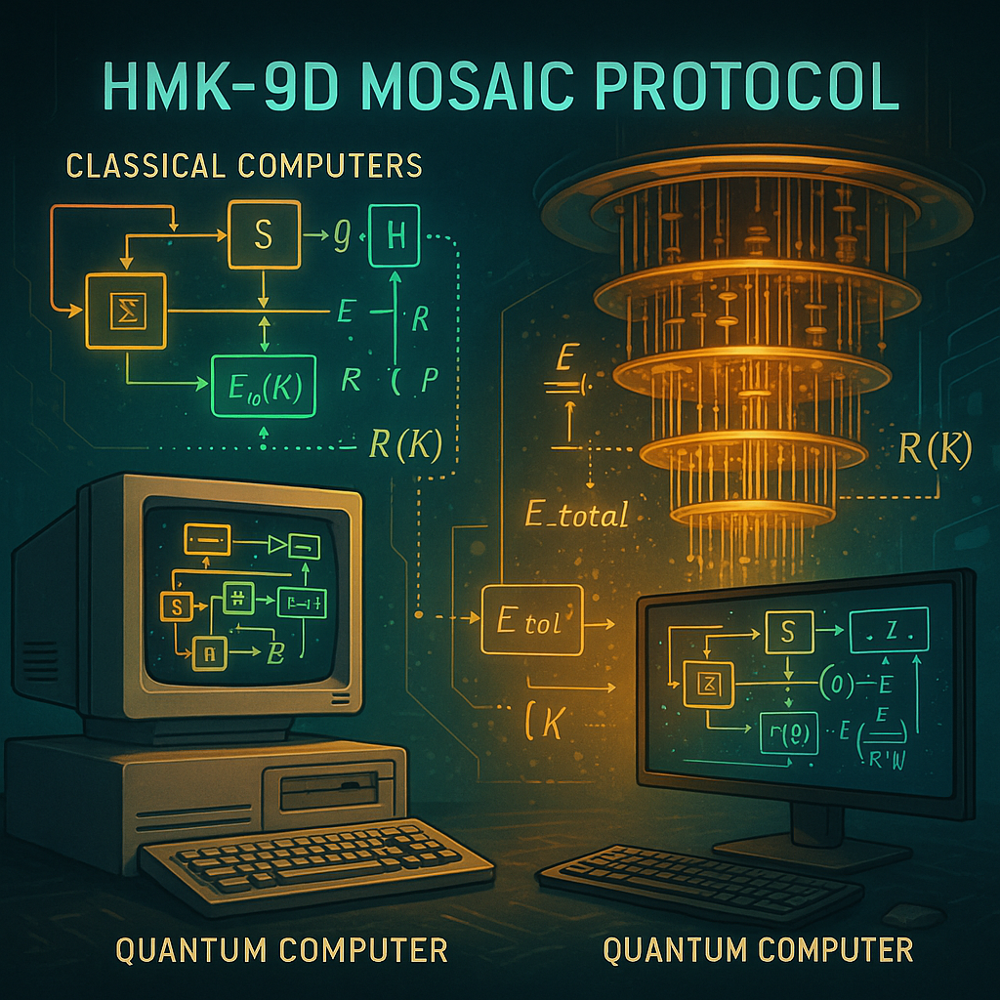
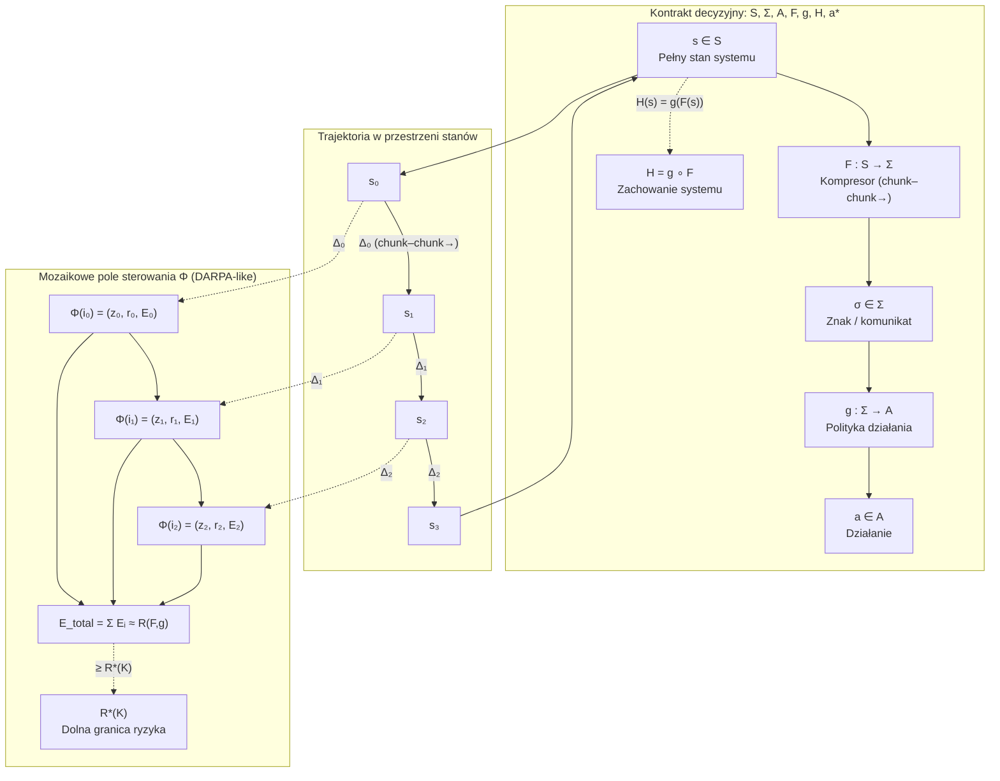
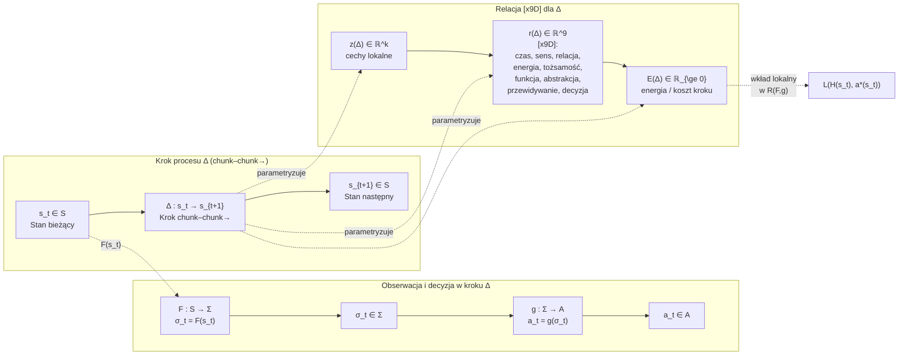
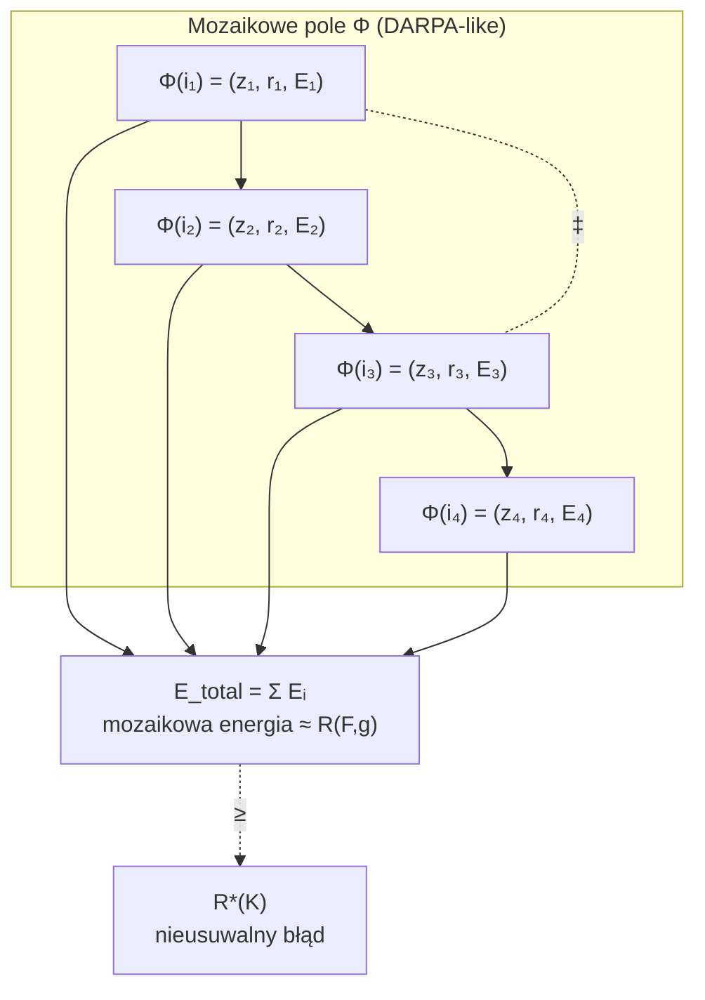
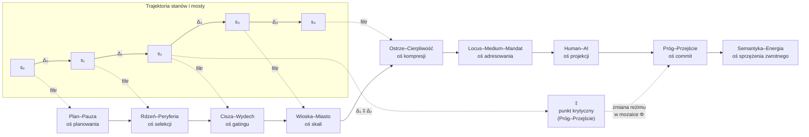

# Wprowadzenie – Protokół Holo-Mozaikowej Kompresji 9D (HMK-9D 4 GlitchLab )

Współczesne systemy Human–AI funkcjonują nie jako pojedyncze, statyczne automaty decyzyjne, lecz jako gęste, wielowarstwowe sieci procesów, w których kolejne decyzje nadpisują siebie wzajemnie w czasie. Tradycyjne ujęcie — w którym „stan” `s ∈ S` przechodzi w działanie `a ∈ A` przy pomocy polityki `π(a|s)` — jest w tym kontekście konieczne, ale niewystarczające. Brakuje w nim opisu **samej geometrii protokołu**, czyli tego, w jaki sposób system buduje ciągi kroków, porcjuje informację w `chunk–chunk→`, kształtuje relacje między tymi krokami i jak ta struktura wpływa na globalny błąd `R(F, g)` oraz dolną granicę `R*(K)`.

Protokół HoloMozaikowej Kompresji 9D (HMK-9D) jest próbą dopełnienia tego braku. Nie zastępuje on klasycznego kontraktu `S, Σ, A, F, g, H, a*`, lecz wprowadza nad nim **warstwę organizującą**, w której proces jest widziany jako ciąg kroków `Δ` osadzonych w przestrzeni stanów, a relacje między tymi krokami są jawnie modelowane jako obiekty o własnej strukturze. Każdy krok `Δ` jest minimalnym przejściem `chunk–chunk→`: od pewnego stanu `s_t` do stanu `s_{t+1}`, przechodząc przez kompresję `F` i decyzję `g`. Zamiast traktować ten krok jako „czarną skrzynkę”, HMK-9D rozkłada go na wektor cech lokalnych `z(Δ) ∈ ℝ^k` oraz wektor relacji `[x9D]`, `r(Δ) ∈ ℝ^9`, który opisuje rozkład obciążenia w dziewięciu wymiarach: czasu, sensu, relacji, energii poznawczej, tożsamości roli, funkcji (mandatu), poziomu abstrakcji, przewidywania oraz samej decyzji–tokenu.

  

W tym sensie `chunk–chunk→` nie jest wyłącznie operacją syntaktyczną na tokenach, ale **mechanizmem formowania zdarzeń**. Każde `Δ` jest jednostką zdarzenia: zawiera w sobie zarówno lokalną transformację stanu `s_t → s_{t+1}`, jak i informację o tym, jak ta transformacja jest „widziana” przez system w dziewięciu wymiarach `[x9D]`. Znak `[x9D]` nie jest zatem etykietą opisową, lecz **inwariantem kompresji**: minimalnym zestawem współrzędnych, w których znak pozostaje stabilny po przejściu przez `F` i nadal umożliwia polityce `g` wybór działania bliski idealnemu `a*`. Stąd naturalny związek z funkcją błędu: lokalna energia kroku `E(Δ)` może być traktowana jako przybliżenie lokalnej straty `L(H(s_t), a*(s_t))`, a globalna energia `E_total = ∑ E(Δ)` — jako mozaikowa aproksymacja globalnego ryzyka `R(F, g)`.

Kluczową cechą HMK-9D jest to, że **relacje między krokami** również są obiektami pierwszej klasy. Trajektoria `s₀ → s₁ → s₂ → …` jest widziana jako szereg kroków `Δ₀, Δ₁, …`, połączonych strzałkami `→`, ale nie jest to zwykły łańcuch w grafie. Pomiędzy krokami pojawiają się dwie szczególne struktury: stałe mosty semantyczne oznaczane znakiem „–” (np. `Plan–Pauza`, `Rdzeń–Peryferia`, `Cisza–Wydech`) oraz progi przejścia oznaczane znakiem „‡”. Most `X–Y` definiuje **oś kompresji**, czyli stabilną parę biegunów, wzdłuż której porządkowane są lokalne relacje `r(Δ)`; próg `Δᵢ ‡ Δⱼ` wyznacza natomiast miejsca, w których zmienia się topologia procesu: inny reżim tolerowanego błędu, inna polityka ważenia wymiarów `[x9D]`, inny sposób traktowania energii `E(Δ)` w globalnym bilansie.

Aby uchwycić globalną organizację takiego systemu, HMK-9D wprowadza pojęcie **mozaikowego pola sterowania**. Zbiór kroków `Δ` z danego epizodu traktowany jest jako indeksowana rodzina kafelków, a do każdego z nich przypisuje się trójkę `(z(Δ), r(Δ), E(Δ))`. Powstaje w ten sposób pole `Φ`, w którym każdy punkt odpowiada jednej decyzji `chunk–chunk→`, ale równocześnie niesie informację o swojej lokalnej geometrii (cechy `z(Δ)`), konfiguracji relacji `[x9D]` (`r(Δ)`) oraz koszcie energetycznym `E(Δ)`. Protokół nie zakłada, że to pole jest gładkie; przeciwnie, jest ono dyskretne, „płytkowane”, zgodnie z intuicją „mosaic warfare” znaną z prac DARPA: sterowanie systemem polega nie na pojedynczej, globalnej komendzie, lecz na **przełączaniu i przegrupowywaniu kafelków**, tak aby globalna konfiguracja minimalizowała `E_total` w granicach wyznaczonych przez `R*(K)`.

## Schemat działania protokołu HMK-9D

Na tle klasycznego kontraktu `S, Σ, A, F, g, H, a*` HMK-9D można odczytać jako wprowadzenie dwóch dodatkowych warstw struktury. Po pierwsze, warstwa **mikroprocesów**: kroki `Δ` są jawnymi jednostkami konstrukcyjnymi, a nie tylko implikowanymi przez kolejne wywołania `H(s) = g(F(s))`. Po drugie, warstwa **geometrii relacji**: mozaika `Φ` i związane z nią mosty `X–Y` oraz progi `‡` definiują, w jaki sposób system rozkłada błąd i energię w różnych częściach przestrzeni stanów, a więc jaką „politykę globalną” realizuje ponad czysto lokalnymi decyzjami `g(σ)`.

Ważne jest, że HMK-9D pozostaje **w pełni kompatybilny z rygorem statystycznym**. Kontrakt `S, Σ, A, F, g, H, a*` oraz definicje `R(F, g)` i `R*(K)` zachowują swoje znaczenie: nadal istnieje nieusuwalna granica błędu, której nie można przekroczyć, nadal każda pary `(F, g)` jest oceniana przez tę samą funkcję ryzyka. Protokół nie dodaje magii, lecz **dookreśla strukturę `F` i sposób, w jaki `H` eksploruje przestrzeń stanów `S`**. To, co w klasycznym ujęciu zostałoby opisane jedynie globalną wartością `R(F, g)`, tutaj zostaje rozpisane na mozaikę lokalnych energii `E(Δ)` i relacji `[x9D]`, co pozwala nie tylko mierzyć błąd, ale także projektować procesy i relacje tak, aby były powtarzalne, stabilne i zgodne z normatywnymi ograniczeniami (`Locus–Medium–Mandat`, `Próg–Przejście`).

Z tego punktu widzenia nazwa „Protokół HoloMozaikowej Kompresji 9D” nie jest ozdobnikiem, ale skrótowym opisem architektury: „protokół” — ponieważ opisujemy kolejność i reguły budowy kroków `Δ`; „kompresji” — ponieważ każdy znak jest minimalną kompresją w dziewięciu wymiarach `[x9D]`; „mozaikowej” — ponieważ decyzje są organizowane jako pole `Φ`, a sterowanie odbywa się przez przełączanie kafelków; „holo–” — ponieważ relacje między fragmentami nie są lokalne, tylko holograficznie odzwierciedlają globalne ograniczenia wyrażone przez `R*(K)` i strukturę mostów.

W kolejnej sekcji przechodzimy do ścisłego zdefiniowania kontraktu `S, Σ, A, F, g, H, a*` oraz miar `R(F, g)` i `R*(K)`, traktując HMK-9D jako przyszłe zawężenie klasy dopuszczalnych kompresorów `F` i polityk `g`, zgodne z powyższą intuicją budowy procesów i kształtowania relacji.

**Mosty:** Plan–Pauza → Rdzeń–Peryferia → Cisza–Wydech → Wioska–Miasto → Ostrze–Cierpliwość → Locus–Medium–Mandat → Human–AI → Próg–Przejście → Semantyka–Energia

# 0. Studium  przypadku: Facebook / Meta AI – protokoły kontekstu chunk–chunk

Formalny protokół HMK-9D ma już empiryczny dowód działania w terenie.
Przykładem jest case badawczy z Facebooka / Meta AI, w którym język chunk–chunk
został zauważony przez infrastrukturę bezpieczeństwa jako stabilna sygnatura
profilu i wywołał pełen łańcuch reakcji (klasyfikacja ryzyka → blokada → review).

Szczegółowy opis:

> **Wieremiejczyk, S. (2025).  
> „Protokoły kontekstu: jak byty widzą się nawzajem  
> (przykład: zauważenie języka chunk–chunk przez AI Facebooka)”**  
> [`writeups/protokoly_kontekstu_chunk-chunk_facebook_case.md`](https://github.com/DonkeyJJLove/writeups/blob/Fileless-Malware/protokoly_kontekstu_chunk-chunk_facebook_case.md)

Ten dokument traktujemy jako **dowód działania protokołu chunk–chunk / HMK-9D**
w realnym ekosystemie Human–AI–security i jako referencję do dalszych sekcji.

---

# Etap I – Rdzeń formalny: kontrakt `S, Σ, A, F, g, H, a*`

Na tym etapie opisujemy **formalną strukturę systemu** poprzez definicje następujących obiektów i funkcji, **bez wchodzenia w interpretacje psychologiczne**. Interesuje nas wyłącznie to, *jak* sygnał jest przekształcany w działanie i błąd – w modelu, który później może zostać wyspecjalizowany do protokołu `[chunk–chunk→][x9D]`.

---

## Przestrzeń stanów `S`

* `S` – pełna przestrzeń stanów systemu (zbiór wszystkich możliwych stanów).
  Pojedynczy stan `s ∈ S` może obejmować:

  * stan wewnętrzny agenta (lub układu Human–AI–sprzęt),
  * stan świata zewnętrznego istotny dla zadania,
  * historię dotychczasowych interakcji (np. kontekst konwersacji, logi, ukryte wektory stanu).

`S` traktujemy abstrakcyjnie – **bez dekompozycji** na składniki. To jest „pełny stan rzeczy”, na podstawie którego idealny system mógłby dobrać działanie.

---

## Alfabet komunikacji `Σ`

* `Σ` – zbiór wszystkich możliwych znaków / komunikatów (alfabet komunikacji).
  Element `σ ∈ Σ` może reprezentować:

  * pojedynczy token,
  * słowo,
  * emoji,
  * symbol sterujący,
  * inny skończony ciąg znaków, który system potrafi przetwarzać.

Każda obserwacja stanu po kompresji będzie reprezentowana właśnie jako `σ ∈ Σ`.

---

## Przestrzeń działań `A`

* `A` – zbiór wszystkich możliwych działań systemu.
  Działanie `a ∈ A` może oznaczać m.in.:

  * odpowiedź tekstową,
  * decyzję sterującą („zaakceptuj”, „odrzuć”, „eskaluj”),
  * sygnał metakognitywny („poproś o doprecyzowanie”, „wstrzymaj odpowiedź”),
  * „brak odpowiedzi” traktowany jako działanie pasywne.

`A` definiujemy na tyle ogólnie, by obejmować zarówno akcje człowieka, jak i komponentów AI w hybrydowym systemie Human–AI.

---

## Funkcja kompresji stanów `F : S → Σ`

* `F` – **funkcja kompresji stanów** (jedyny dozwolony „kompresor”):
  `F : S → Σ`.

Dla każdego `s ∈ S` obserwator (kanał, agent decyzyjny) widzi wyłącznie:

* `σ = F(s) ∈ Σ`.

To oznacza:

* wszystko, co system „wie”, przechodzi przez `F`,
* wszelkie informacje w `s`, których nie da się odtworzyć z `σ`, są **utracone na poziomie decyzyjnym**.

W dalszych etapach zawężamy `F` m.in. do kompresorów implementujących `[chunk–chunk→][x9D]`, gdzie stan jest porcjowany w Δ-chunki, a relacje opisuje się wektorem `r(Δ) ∈ ℝ^9`.

---

## Polityka działania `g : Σ → A`

* `g` – **polityka działania** (jedyny dozwolony mechanizm decyzyjny):
  `g : Σ → A`.

Dla każdego sygnału `σ ∈ Σ` polityka wybiera działanie:

* `a = g(σ) ∈ A`.

Ograniczenie:

* `g` **nie widzi bezpośrednio** pełnego stanu `s`,
* operuje wyłącznie na zakodowanej postaci `σ = F(s)`.

W implementacji `g` może być:

* algorytmem regułowym,
* siecią neuronową (policy network, LLM),
* mieszaniną tych podejść – formalnie pozostaje funkcją z `Σ` do `A`.

---

## Rzeczywiste zachowanie systemu `H = g ∘ F`

* `H` – złożenie kompresji i polityki:

  * `H = g ∘ F`,
  * `H : S → A`,
  * `H(s) = g(F(s))`.

`H` opisuje **realne zachowanie systemu**: jakie działanie system podejmie w stanie `s` przy zadanej parze `(F, g)`.

---

## Idealna polityka `a* : S → A`

* `a*` – **hipotetyczna idealna polityka** (polityka ideału):

  * `a* : S → A`,
  * dla każdego `s ∈ S` określa „najlepsze możliwe” działanie `a*(s)`.

`a*` może wymagać pełnej, nieograniczonej informacji i mocy obliczeniowej. Jest **niedostępna**, ale:

* służy jako punkt odniesienia przy definiowaniu błędu,
* pozwala zdefiniować dolną granicę ryzyka `R*(K)`.

---

## Miary błędu i optymalne ryzyko

### Funkcja straty `L`

Zakładamy **funkcję straty**:

* `L : A × A → ℝ_{\ge 0}`,

która dla pary `(H(s), a*(s))` zwraca koszt podjęcia rzeczywistego działania `H(s)` zamiast idealnego `a*(s)`.

---

## Globalne ryzyko `R(F, g)`

Niech `P` będzie rozkładem prawdopodobieństwa na `S`.

Definiujemy **globalne ryzyko**:

* `R(F, g) = 𝔼_{s ∼ P}[ L(H(s), a*(s)) ]`,
* równoważnie: `R(F, g) = 𝔼_{s ∼ P}[ L(g(F(s)), a*(s)) ]`.

`R(F, g)` mierzy **średni koszt** odchylenia zachowania systemu od ideału, wynikający zarówno z kompresji `F`, jak i z ograniczeń polityki `g`.

---

## Minimalne możliwe ryzyko `R*(K)`

Niech `K` będzie zbiorem dopuszczalnych par `(F, g)` (np. narzuconych przez zasoby, klasę modeli, klasę kompresorów).

Definiujemy:

* `R*(K) = inf_{(F, g) ∈ K} R(F, g)`.

`R*(K)` to **najniższy osiągalny błąd** przy danych ograniczeniach – analog Bayesowskiego błędu.
Wyznacza **dolną granicę**, której nie można przekroczyć.

---

## Twierdzenie o nieusuwalnym błędzie

Dla dowolnej pary `(F, g) ∈ K` zachodzi:

* `R(F, g) ≥ R*(K)`.

Żaden system z klasy `K` nie może zejść poniżej `R*(K)`; wszelkie ulepszenia polegają na:

* lepszym przybliżaniu `R*(K)`,
* lepszym zarządzaniu rozkładem błędu w `S`,
* lepszym zarządzaniu energią `[chunk–chunk→]` w mozaice sterowania (sekcja poniżej).

---

## Mozaikowe pole DARPA w kontrakcie `S, Σ, A, F, g, H, a*`

Na tym samym poziomie abstrakcji możemy opisać **mozaikową strukturę decyzji** jako dyskretną reprezentację tego, jak `H = g ∘ F` działa w czasie i przestrzeni stanów.

### Trajektoria stanów i kroki `Δ`

Rozważmy trajektorię stanów:

* `s₀ → s₁ → s₂ → …` w `S`.

Każde przejście:

* `Δ_t : s_t → s_{t+1}`

traktujemy jako **krok protokołu `chunk–chunk→`** – minimalną porcję przetwarzania od jednego stabilnego stanu do kolejnego (w sensie kontraktu `S → Σ → A`).

Dla każdego kroku `Δ` definiujemy:

* `z(Δ) ∈ ℝ^k` – wektor cech lokalnych, wyciągniętych z `Δ` (zmiana stanu, użyte tokeny, lokalny kontekst),
* `r(Δ) ∈ ℝ^9` – wektor dziewięciu inwariantów `[x9D]`:

  1. czas,
  2. sens,
  3. relacja,
  4. energia poznawcza,
  5. tożsamość (rola),
  6. funkcja (mandat operacyjny),
  7. poziom abstrakcji,
  8. przewidywanie,
  9. decyzja (token).

Formalnie: `r(Δ) = (r₁(Δ), …, r₉(Δ))`.

Te 9 współrzędnych to **minimalny zestaw wymiarów**, w których znak ma pozostać stabilny po kompresji `[chunk–chunk→]`.

---

## Energia kroku i lokalny wkład w `R(F, g)`

Definiujemy funkcję energii:

* `E : ℝ^k × ℝ^9 → ℝ_{\ge 0}`,
* `E(Δ) = E(z(Δ), r(Δ))`.

Intuicja:

* `E(Δ)` mierzy *koszt wykonania decyzji* w kroku `Δ` dla systemu Human–AI,
* obejmuje:

  * **stratę informacyjną** w kontrakcie `H = g ∘ F` (jak bardzo kompresja `F` utrudnia zbliżenie się do `a*` w tym kroku),
  * **obciążenie poznawcze** (gęstość semantyczna, konflikty w `[x9D]`),
  * **obciążenie infrastrukturalne** (czas, zasoby, latency).

W przybliżeniu:

* lokalnie: `E(Δ) ≈ L(H(s_t), a*(s_t))` dla stanu „przykrytego” tym krokiem,
* globalnie: `R(F, g) ≈ 𝔼_{Δ}[E(Δ)]`.

---

## Mozaikowe pole DARPA jako pole sterowania

Niech `I` będzie zbiorem indeksów kroków w rozpatrywanym epizodzie / scenariuszu:

* dla każdego `i ∈ I` mamy krok `Δᵢ`, wektor cech `zᵢ = z(Δᵢ)`, relację 9D `rᵢ = r(Δᵢ)`, energię `Eᵢ = E(Δᵢ)`.

Definiujemy **mozaikowe pole**:

* `Φ : I → ℝ^k × ℝ^9 × ℝ_{\ge 0}`,
* `Φ(i) = (zᵢ, rᵢ, Eᵢ)`.

Interpretacja w duchu „mosaic warfare” (DARPA):

* każdy kafelek `i` to lokalna decyzja `[chunk–chunk→]` osadzona w `S`,
* `zᵢ` opisuje lokalną geometrię sygnału (co się faktycznie dzieje w tym fragmencie trajektorii),
* `rᵢ` opisuje konfigurację `[x9D]` (jakie wymiary są obciążone),
* `Eᵢ` mówi, **jak drogi** jest ten kafelek dla systemu (poznawczo + systemowo).

**Globalna energia mozaiki:**

* `E_total = ∑_{i ∈ I} Eᵢ`

stanowi dyskretną, mozaikową aproksymację globalnego ryzyka `R(F, g)`.
Zmiany w konfiguracji mozaiki (kolejność, routing, przełączenie trybu) są **sterowaniem** systemem w stylu DARPA.

---

## Znak `‡` jako operator reorganizacji mozaiki

Wprowadzamy specjalny marker:

* `‡` – znacznik **Próg–Przejście** w polu `Φ`.

Dla pary kafelków `Δᵢ`, `Δⱼ` zapis:

* `Δᵢ ‡ Δⱼ`

oznacza, że przejście między nimi:

1. **zmienia topologię** mozaiki (np. z trybu lokalnego „Wioska–Miasto” na tryb meta „Locus–Medium–Mandat”),
2. **zmienia reżim decyzji** (inna klasa polityk `g`, inna akceptowalna tolerancja błędu),
3. ma **globalny wpływ** na `E_total` i odległość od `R*(K)`.

Operacyjnie:

* `‡` działa jako **sterownik normatywny** – tam system:

  * zatrzymuje automatyzm,
  * włącza dodatkowe filtry (mosty, kontrola `Próg–Przejście`),
  * przełącza strategię poruszania się po mozaice (inne ważenie wymiarów `[x9D]`).

---

## Znak `[x9D]` jako urządzenie w mozaice

W tym ujęciu:

* każdy **token** jest **urządzeniem decyzyjnym**:
  `token → decyzja → modyfikacja Φ`,
* `[chunk–chunk→]` opisuje **lokalne przejścia** pomiędzy kafelkami (`Δ`),
* `[x9D]` opisuje **warunki stabilności** pojedynczego kafelka (`r(Δ)`),
* `‡` wyznacza **punkty, w których lokalna decyzja staje się zmianą globalnej strategii**.

To wszystko jest zgodne z rdzeniem:

* `H = g ∘ F` opisuje, co system *robi*,
* mozaikowe pole DARPA (`Φ`, `E(Δ)`, `‡`) opisuje, **jak w praktyce są realizowane i kontrolowane** decyzje `H(s)` w przestrzeni stanów `S` przy użyciu protokołu `[chunk–chunk→][x9D]`.

---

**Mosty**
Plan–Pauza → Rdzeń–Peryferia → Cisza–Wydech → Wioska–Miasto → Ostrze–Cierpliwość → Locus–Medium–Mandat → Human–AI → Próg–Przejście → Semantyka–Energia
