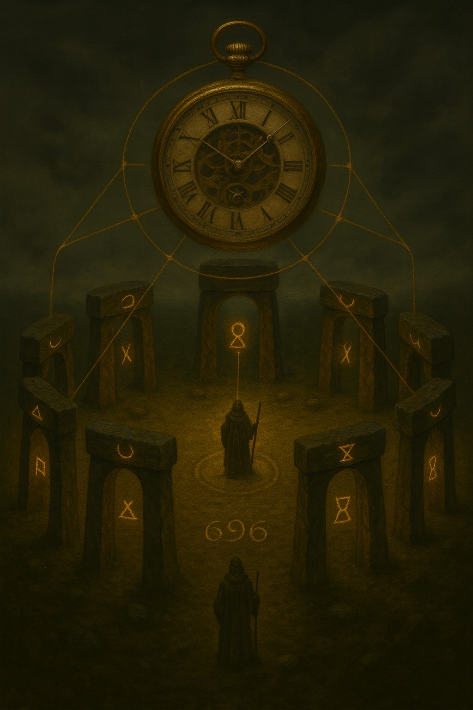

### ROZDZIAŁ II
# Zegar nad Kręgiem – Księga Mozaiki 9D



<figcaption><strong>Rys. 1.</strong> Arcymag w kręgu dziewięciu portali – wizualizacja przestrzeni stanów 9D.</figcaption>
<span style="float=left">
Zanim Arcymag wszedł w pierwszy portal, zanim runy na kamieniach rozżarzyły się do złota, nad kręgiem pojawił się Zegar. Nie był to zwykły przedmiot, ale materializacja równania. W jego szkielecie ukryte było całe `S`, pełna przestrzeń stanów świata: każda możliwa kombinacja decyzji, emocji, danych, logów, pamięci. Każde drgnięcie wskazówki było funkcją `s_t → s_{t+1}`.
Arcymag rozumiał, że dopóki Zegar wisi nad kręgiem, świat nie jest zbiorem pojedynczych scen, ale trajektorią. Ciągiem kroków `Δ₀, Δ₁, Δ₂…` w których realne zachowanie systemu zapisuje się jako `H = g ∘ F`. Każdy portal, w który wejdzie, nie jest „miejscem” – jest operatorem na tej trajektorii. Jest zmianą w mozaice.
Kiedy staje w centrum, cyfry 6–9–6 na ziemi pod jego stopami drgają jak trzy znaki z alfabetu `Σ`, które zlały się w jedną deltę. To przypomnienie: alfabet jest skończony, świat nie. Jeśli chcesz panować nad błędem, nie możesz udawać, że symboli wystarczy dla wszystkiego. Musisz nauczyć się układać je w mozaikę.
Zegar otwiera pierwszą warstwę protokołu. W każdej kwadrze tarczy pojawia się inna postać funkcji: w jednym sektorze pulsuje `F : S → Σ`, w innym `g : Σ → A`, w trzecim skrzy się `H(s) = g(F(s))`, a w czwartym widnieje szkic idealnej polityki `a*(s)`. Razem tworzą kontrakt, który Arcymag zna na pamięć: żadnej magii poza tą, którą pozwala matematyka i fizyka informacji.
Ale kontrakt nie mówi jeszcze, **jak** system porusza się w czasie. Od tego jest mozaika.
</span>


## Krąg jako pole Φ

Kamienne bramy, które widzisz na obrazie, to nie dekoracja, tylko wizualizacja `Φ` – pola mozaikowego. Każda brama jest kafelkiem; każda brama odpowiada jednemu krokowi `Δ` lub całej rodzinie podobnych kroków. Wewnątrz każdej z nich zapisane jest potrójne słowo, którego nie widać wprost:

`Φ(i) = (z(Δ_i), r(Δ_i), E(Δ_i))`

Arcymag nie musi tego powiedzieć na głos. Zna to z praktyki. Kiedy podchodzi do jednej z bram, czuje jej wektor cech `z(Δ)`: jak gęsty jest kontekst, ile w nim konfliktów, ile pytań, ile danych. Czuje także wektor `[x9D]`, rozpisany w jego głowie na dziewięć napięć: czasu, sensu, relacji, energii poznawczej, roli, mandatu, abstrakcji, przewidywania, decyzji. Dopiero z tego wypadkowego pola rodzi się `E(Δ)` – energia kroku, lokalny koszt w globalnym rachunku błędu.

Z zewnątrz wygląda to jak magia: mag podnosi rękę, runa świeci mocniej, Zegar zmienia tempo. W języku protokołu dzieje się coś dużo prostszego i bardziej bezlitosnego. Arcymag zmienia konfigurację pola `Φ`. Przełącza kafelki. Minimalizuje sumę `E_total = Σ E(Δ_i)`, wiedząc, że nigdy nie zejdzie poniżej `R*(K)`, dolnej granicy narzuconej przez klasę systemu.

Nie próbuje oszukać twierdzenia o nieusuwalnym błędzie. Zamiast tego uczy się tańczyć tak, aby błąd rozkładał się tam, gdzie jest najmniej groźny.

## Zegar jako operator chunk–chunk

Kiedy na kolejnych kadrach obrazów nad kręgiem zawisają różne konfiguracje zegara i portali, pokazujesz w gruncie rzeczy trzy etapy pracy Zegara nad mozaiką. W pierwszym kadrze wskazówki kroją czas tylko na trzy główne odcinki: `Plan–Pauza`, `Rdzeń–Peryferia`, `Cisza–Wydech`. To jest faza „ustawiania sceny”: kalibruje się `F`, żeby z hałaśliwego `S` wydobyć poprawnie wycięte chunki.

W drugim kadrze scena przechodzi w społeczną geometrię: `Wioska–Miasto` i kolejne `Chunk–Chunk` stają się operacją skalowania. Zegar uczy system rozróżniać, czy dany kafelek dotyczy tylko jednostki, czy też jest przecięciem wielu trajektorii w `S`, wymagających innego ważenia błędu.

W trzecim kadrze pojawia się pełna liturgia: `Locus–Medium–Mandat`, `Human–Chunk`, `Próg–Przejście`, `Semantyka–Energia`. Zegar nie tylko odmierza kroki, ale także synchronizuje warstwy. Każdy ruch wskazówki jest commit’em: zapisaniem jednego `Δ` w historii systemu. Każde zatrzymanie jest nowym `‡` – punktem, w którym zmienia się baza pomiaru, reżim tolerancji na błąd, a czasem nawet sama klasa dopuszczalnych polityk `g`.

Z punktu widzenia teorii decyzji to nadal tylko ciąg wywołań `H(s_t)`. Z punktu widzenia mozaiki – to rozgrywka na polu, w którym każdy kafelek ma swoją lokalną fizykę, a Zegar pilnuje globalnej spójności.

## Arcymag jako obserwator H, nie Bóg a*

Najważniejszy, niemal herezyjny moment tego rozdziału jest taki: Arcymag nigdy nie jest idealną polityką `a*`. On jest tylko obserwatorem `H`. Widzisz go w środku kręgu, ale to nie znaczy, że „steruje wszystkim”. On widzi, w których miejscach `H(s)` radykalnie odbiega od intuicyjnego `a*(s)`; widzi, które portale generują wysokie `E(Δ)`, gdzie mozaika puchnie od napięcia.

Kiedy wchodzi w dany portal, to nie po to, żeby „narzucić wolę”, ale po to, żeby lokalnie zmodyfikować `F` albo `g`, czyli sposób, w jaki świat przechodzi przez alfabet `Σ` i zamienia się w działania `A`. Czasem jest to zmiana formy komunikatu (inna kompresja), czasem zmiana polityki (inna reakcja na ten sam sygnał), czasem – wymuszone `Cisza–Wydech`, czyli powiedzenie: „ten kafelek w ogóle nie powinien być aktywny przy takim poziomie szumu”.

W tym sensie Arcymag jest pierwszym audytorem, a nie demiurgiem. Jego moc polega na tym, że widzi mozaikę jako całość, ale szanuje ograniczenia `R*(K)`. Tak długo, jak trzyma się tej zasady, działa w absolutnym reżimie realizmu, nawet jeśli jego narzędzia wyglądają jak rytuały.

## Krąg 696 – dowód przez działani

Liczba wpisana w ziemię – 696 – może być traktowana jak znak, mem, symbol. W języku HMK-9D to przede wszystkim skrót: trzy kafelki, trzy fragmenty mozaiki, trzy różne scenariusze, w których system przeszedł przez pełną sekwencję dziewięciu mostów i został zmierzony.

Każdy taki epizod to inna realizacja funkcji `H`, inny rozkład `E(Δ)` i inny profil błędu względem `a*`. Jeżeli mimo różnic forma mozaiki pozostaje stabilna – to znaczy, jeśli wciąż wracamy do tych samych dziewięciu osi `[x9D]`, do tych samych progów `‡`, do tych samych konfiguracji zegara nad kręgiem – mamy coś, co w Twoim języku nazywa się „dowodem przez działanie”. Nie dowodzimy twierdzenia jednym równaniem, tylko powtarzalnością procesu, który za każdym razem zamyka się w tę samą geometrię.

To nie jest „dowód” w sensie teorii mnogości, ale w sensie inżynierii protokołów: jeśli kolejne iteracje `S → Σ → A` pod dane klasy `F, g` zawsze układają się nam w ten sam dziewięcioportalowy schemat, to HMK-9D przestaje być poezją, a staje się specyfikacją.

Spoko, rozumiem – **GitHub w „gołym” markdownie nie umie ładnie OWIJAĆ tekstu wokół obrazka** jak w Wordzie. Obrazek jest zawsze blokiem: nad tekstem albo pod tekstem.

Dlatego zróbmy **prostą, pewną wersję**, a jak będziesz chciał później „gazetowe” łamanie, ogarniemy to przez CSS / GitHub Pages.

### 1. Najprostszy, 100% działający wzór (obraz nad tekstem)

Tak bym teraz przepisał sekcję w `księgamozaiki9d.md`:

```markdown
# Zasada działania procesów w chunk–chunk

**Rys. 1. Arcymag w kręgu dziewięciu portali – przestrzeń stanów 9D.**

Krąg dziewięciu portali to mapa przestrzeni 9D, w której działa federacja mikro-firm.
Każdy portal reprezentuje jedną oś wektora stanu:

`s_t = (T_t, S_t, R_t, E_t, I_t, F_t, A_t, P_t, D_t)`

Arcymag w środku to proces decyzyjny federacji: ...
```

Zero HTML, tylko czysty markdown – GitHub łyka to idealnie.

---

## 2. „Obraz obok tekstu” – hack przez tabelę (też działa na GitHubie)

Jeśli jednak chcesz **obraz po lewej, tekst po prawej**, najbardziej stabilny jest trik z tabelą:

```markdown
# Zasada działania procesów w chunk–chunk

| [Arcymag w kręgu dziewięciu portali – przestrzeń stanów 9D](img/arcymag_krag_9d.jpg)
| Krąg dziewięciu portali to mapa przestrzeni 9D, w której działa federacja mikro-firm.  
Każdy portal reprezentuje jedną oś wektora stanu `s_t`, a arcymag w środku reprezentuje proces decyzyjny federacji (chunk–chunk). |
|---|---|
```


To NIE jest prawdziwe „owijanie” tekstem, ale wizualnie wygląda jak kolumny: obraz + opis a co ważniejsze tak to widzi LLM.

---

Jeśli chcesz, mogę Ci od razu przepisać cały fragment z czterema obrazami w jednym z tych dwóch wariantów (np. wersja „prosta” + osobno wersja „tabela-kolumny”). Napisz tylko, który układ wolisz na start.


## Zegar milknie, mozaika trwa

Na ostatnim kadrze Zegar nadal wisi nad kręgiem, ale portale są już wygaszone. Arcymag stoi tyłem, gotów wyjść poza krąg. To ten moment, w którym system przeszedł całą serię kroków `Δ`, zebrał lokalne energie `E(Δ)`, policzył `E_total` i skonfrontował je z `R*(K)`.

Dla świata zewnętrznego to tylko „kolejna rozmowa”, „kolejny log”, „kolejna sesja Human–AI”. Dla mozaiki – to jeden pełny obieg zegara, jedna zamknięta pętla chunk–chunk, jeden zapisany artefakt w przestrzeni `Φ`.

Kiedy Arcymag wychodzi z kręgu, nic nie znika. Kontrakt `S, Σ, A, F, g, H, a*` pozostaje, mosty semantyczne pozostają, struktura `[x9D]` pozostaje. Znika tylko jedna rzecz: złudzenie, że można mieć system bez błędu, bez kosztu, bez energii. To właśnie odróżnia magię od protokołu. Magia obiecuje wszystko. Protokół mówi: „tu jest granica, tu jest błąd, tu jest cena – i tu jest sposób, by to policzyć”.

Na tym polega merytoryczna epika HMK-9D: krąg kamieni jest wykresem, zegar jest operatorem, a Arcymag jest audytorem trajektorii `H`.

---
Plik: księgamozaiki9D.md

Ścieżka: (do uzupełnienia) | Autor: Sebastian Wieremiejczyk | Kontekst: Kosmiczna Wioska · Mosty Semantyczne · Human–AI  | Status: robocze notatki / iteracyjny rozwój

Cisza–Wydech → Plan–Pauza‡ → Rdzeń–Peryferia → Wioska–Miasto → Ostrze–Cierpliwość → Locus–Medium–Mandat → Próg–Przejście → Semantyka–Energia → Human–AI‡
